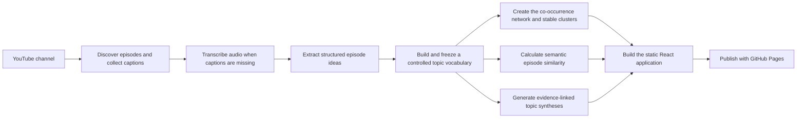

# Directionally Correct topic and episode explorer

An interactive way to explore the public archive of the Directionally Correct podcast across topics,
episodes, guests, and recurring ideas.

**Live application:** https://lstehlik2809.github.io/directionally-correct-topic-map/

## What the application shows

- a topic network, frequency view, timeline, and searchable episode catalog
- topic relationships, clusters, occurrence counts, and episode-level co-occurrence
- episode details, structured ideas, source links, and semantically related episodes
- evidence-linked topic syntheses showing convergence, divergence, tensions, and distinctive ideas
- filters for publication date, guest, topic, and cluster

## Pipeline at a glance

The pipeline runs locally and is resumable. Transcripts, episode ideas, topic assignments, embeddings,
and syntheses are reused when their inputs have not changed. The public application receives only the
compiled interface and four browser-ready JSON datasets; it makes no model or API calls at runtime.

## Pipeline, step by step

### 1. Discover episodes and obtain transcripts

The Apify YouTube Scraper discovers recent long-form uploads, retrieves episode metadata, and collects
available English captions. Equivalent uploads are reconciled so one podcast episode does not become
multiple records.

When captions are unavailable, the fallback downloads the audio with `yt-dlp`, splits it with FFmpeg,
and transcribes the chunks with OpenAI's `gpt-4o-transcribe`. Text transcripts, SRT captions, source
metadata, and processing status remain in the local corpus.

### 2. Turn each episode into structured ideas

GPT-5.6 Sol reads each transcript and returns a structured set of concise, self-contained concept
statements. The extraction prioritizes definitions, causal mechanisms, disagreements, decision
principles, and practical implications while removing introductions, advertisements, repetition, and
other low-information material.

Every concept receives a stable ID tied to its episode. These IDs become the evidence units used by the
later topic-assignment and synthesis stages.

### 3. Build a controlled topic vocabulary

The topic layer is deliberately more constrained than unconstrained keyword extraction:

1. Episodes are processed chronologically against the topic library built so far.
2. Existing topics are reused whenever they fit; genuinely missing concepts may propose a new topic.
3. Every proposed topic passes a separate reconciliation step to catch alternate wording and aliases.
4. The completed library is audited for semantic duplicates. Merged topic IDs remain as redirects for
   traceability.
5. All episodes are classified again against the frozen final vocabulary, reducing the order effect that
   would otherwise privilege early episodes.

Each episode-topic assignment is marked as primary or secondary and cites the supporting concept IDs.
Broader, narrower, and merely related topics are kept separate; only interchangeable labels are merged.

### 4. Construct the topic network

Each node is a controlled topic. Node frequency is the number of episodes assigned to it. An edge joins
two topics when they occur in the same episode, and its weight is the number of episodes in which that
pair co-occurs. The network therefore represents co-occurrence, not a claim that two topics have a
causal or logical relationship.

Weighted Louvain community detection groups the full network into clusters. The run uses a fixed random
seed for reproducibility. After every corpus update, detected clusters are matched to the previous build
by weighted topic overlap so continuing clusters retain stable IDs and colors. New or materially changed
clusters receive short descriptive labels generated by GPT-5.6 Sol from their most frequent topics.

### 5. Calculate semantic similarity

Each episode is represented by its primary and secondary topic tags plus its structured concept
statements. OpenAI `text-embedding-3-large` embeddings and cosine similarity produce the nearest related
episodes. Titles, dates, guests, hosts, and other episode metadata are excluded from the embedding text
so the ranking is driven by topic and concept content rather than identity or chronology.

Embeddings are cached per episode and recalculated only for changed inputs. The similarity ranking is
computed before deployment and stored as static data.

### 6. Create evidence-linked topic syntheses

For every topic, GPT-5.6 Sol receives only the concept statements cited by that topic's episode
assignments. It produces a compact overview plus evidence-backed convergence, divergence or tensions,
and distinctive ideas.

Every generated claim must cite valid episode and concept IDs from its input. The pipeline rejects
missing or out-of-scope citations, prevents single-episode topics from claiming cross-episode agreement
or disagreement, and regenerates a synthesis when its underlying evidence changes. These checks make
the output inspectable, although it should still be treated as an exploratory model-generated synthesis
rather than ground truth.

### 7. Build, check, and publish the explorer

The interface is written in React and TypeScript. `react-force-graph-2d` renders the network, Graphology
provides the graph representation and Louvain implementation, and Vite compiles the application into
static HTML, CSS, and JavaScript.

Before packaging, the update command runs corpus tests, linting, TypeScript checks, application unit
tests, a production build, and a dependency audit. It then builds a deployment-only `site/` directory,
validates all public JSON, checks the package for credential-like strings, and publishes it through
GitHub Actions and GitHub Pages.

## Main tools and their roles

| Stage | Products and libraries |
|---|---|
| YouTube discovery, metadata, and captions | Apify YouTube Scraper |
| Missing-caption fallback | `yt-dlp`, FFmpeg, OpenAI `gpt-4o-transcribe` |
| Idea extraction, topic vocabulary, cluster labels, and topic synthesis | OpenAI API with GPT-5.6 Sol |
| Semantic similarity | OpenAI `text-embedding-3-large` |
| Network construction and clustering | Graphology and weighted Louvain community detection |
| Interface | React, TypeScript, `react-force-graph-2d`, and Vite |
| Development and iteration | OpenAI Codex |
| Hosting | GitHub Actions and GitHub Pages |

## What is in this repository

This public repository is deliberately deployment-only:

- `site/` contains the compiled application, its visual assets, and the four JSON datasets required in
  the browser
- `.github/workflows/deploy-pages.yml` publishes `site/` to GitHub Pages
- this README documents the construction and interpretation of the application

Source corpora, transcripts, development source code, tests, data-generation utilities, model caches,
logs, and credentials are not published. Only the derived browser datasets are public, and the deployed
site contains no API key.
